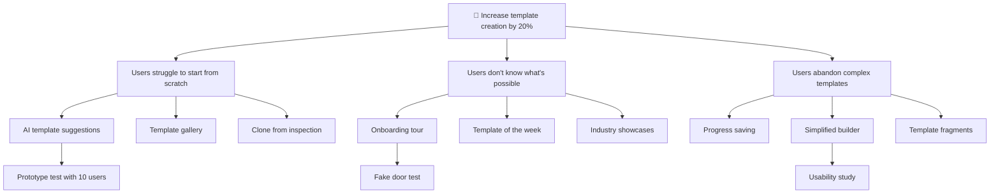

# Opportunity Tree Builder

Map outcomes to opportunities to solutions using Teresa Torres' Opportunity Solution Tree methodology. Prevent premature solution commitment by exploring the problem space systematically.

## Invocation

```
/opportunity-tree "Outcome or metric to improve"
```

Or natural language:
- "Build an opportunity tree for..."
- "Map opportunities for improving..."
- "What opportunities exist for..."

---

## The Problem

Teams jump to solutions before understanding opportunities. They build the first idea that sounds good, then wonder why it doesn't move metrics.

## What You Get

- Outcome-to-opportunity-to-solution mapping
- Multiple solutions per opportunity (prevents premature commitment)
- Assumption identification
- Experiment prioritization
- Visual tree structure
- Teresa Torres methodology applied

---

## The Opportunity Solution Tree Framework

```
                    [DESIRED OUTCOME]
                          │
            ┌─────────────┼─────────────┐
            │             │             │
      [Opportunity 1] [Opportunity 2] [Opportunity 3]
            │             │             │
       ┌────┴────┐   ┌────┴────┐   ┌────┴────┐
       │         │   │         │   │         │
   [Sol A]   [Sol B] [Sol C] [Sol D] [Sol E] [Sol F]
       │         │       │
   [Exp 1]   [Exp 2] [Exp 3]
```

### Tree Components

| Level | What It Is | Example |
|-------|------------|---------|
| **Outcome** | Measurable business/product goal | "Increase template creation by 20%" |
| **Opportunity** | User need/pain point that, if addressed, moves the outcome | "Users struggle to start from scratch" |
| **Solution** | Specific product/feature idea | "AI-generated template suggestions" |
| **Experiment** | Smallest test to validate a solution | "Show 3 AI suggestions to 100 users, measure adoption" |

---

## Building the Tree: Step by Step

### Step 1: Define the Outcome

Start with a measurable outcome:

```markdown
## Desired Outcome

**Outcome statement:** [What metric do we want to move?]
**Current state:** [Where are we now?]
**Target state:** [Where do we want to be?]
**Timeframe:** [By when?]
**Why this matters:** [Business impact]
```

**Good outcomes:**
- "Increase weekly active users from 50K to 75K in 6 months"
- "Reduce inspection completion time by 30%"
- "Increase template sharing from 5% to 25% of users"

**Bad outcomes (fix these):**
- "Improve the app" → Too vague, no metric
- "Build feature X" → That's a solution, not an outcome
- "Make users happy" → Not measurable

### Step 2: Discover Opportunities

Opportunities are unmet user needs that prevent the outcome. They come from:
- User interviews
- JTBD analysis (from `/jtbd`)
- Support tickets
- Usage analytics
- Customer feedback

```markdown
## Opportunity Discovery

**Source:** [Where did we learn about this?]

### Opportunity 1: [User need/pain statement]
**Evidence:** [Quotes, data, observations]
**Frequency:** [How often does this come up?]
**Severity:** [Impact when it happens]
**Connection to outcome:** [How does solving this move the metric?]

### Opportunity 2: ...
```

**Opportunity framing tips:**
- Frame as user needs, not solutions
- "Users struggle to..." ✓
- "We should add..." ✗
- Each opportunity should clearly connect to the outcome

### Step 3: Generate Multiple Solutions Per Opportunity

**Critical rule:** Never commit to the first solution. Generate at least 3 per opportunity.

```markdown
## Solutions for [Opportunity Name]

### Solution A: [Name]
**Description:** [What would we build?]
**Effort estimate:** [T-shirt size: S/M/L/XL]
**Assumptions:**
1. [What must be true for this to work?]
2. [What are we guessing about?]
**Risks:** [What could go wrong?]

### Solution B: [Name]
**Description:** ...

### Solution C: [Name]
**Description:** ...
```

### Step 4: Identify and Prioritize Assumptions

Every solution has assumptions. Surface them before building.

```markdown
## Assumption Mapping

### Solution: [Name]

| Assumption | Type | Risk Level | Evidence We Have |
|------------|------|------------|------------------|
| Users want X | Desirability | High | 3 interview mentions |
| We can build Y in Z time | Feasibility | Medium | Similar past project |
| This will move metric by N% | Viability | High | None - need to test |

**Riskiest assumption:** [Which one, if wrong, kills the solution?]
**Test for riskiest assumption:** [Smallest experiment to validate]
```

**Assumption types:**
- **Desirability:** Do users want this?
- **Feasibility:** Can we build this?
- **Viability:** Will this work for the business?
- **Usability:** Can users figure it out?

### Step 5: Design Experiments

For each high-priority solution, design the smallest test:

```markdown
## Experiment Design

### Experiment: [Name]
**Solution being tested:** [Which solution]
**Assumption being tested:** [Which assumption]

**Hypothesis:** If we [do X], then [Y will happen], measured by [Z].

**Experiment type:** [Prototype test / Fake door / Wizard of Oz / A/B test / Survey / Interview]

**Success criteria:**
- [Metric 1] reaches [threshold]
- [Metric 2] reaches [threshold]

**Failure criteria:**
- [Metric 1] below [threshold] = kill the solution
- [Metric 2] shows [signal] = pivot

**Effort:** [Hours/days to run]
**Duration:** [How long to collect data]
**Sample size:** [How many users needed]
```

### Step 6: Prioritize Experiments

Rank experiments by:
1. **Risk reduction:** How much uncertainty does this eliminate?
2. **Effort:** How quickly can we learn?
3. **Decision impact:** Does this inform a critical choice?

```markdown
## Experiment Prioritization

| Rank | Experiment | Assumption Tested | Effort | Risk Reduction | Decision Impact |
|------|------------|-------------------|--------|----------------|-----------------|
| 1 | [Name] | [Assumption] | S | High | Go/no-go on solution |
| 2 | [Name] | [Assumption] | M | Medium | Scope decision |
| 3 | [Name] | [Assumption] | L | High | Architecture choice |
```

---

## Output Template: Full Opportunity Tree

```markdown
# Opportunity Solution Tree: [Outcome Name]

## 🎯 Desired Outcome

**Metric:** [Specific measurable goal]
**Current:** [Baseline]
**Target:** [Goal]
**Timeframe:** [Deadline]
**Owner:** [Who's accountable]

---

## 🌳 The Tree

```
[OUTCOME: Increase X by Y%]
│
├── [Opportunity 1: Users struggle with...]
│   ├── Solution 1A: [Name]
│   │   └── Experiment: [Test name]
│   ├── Solution 1B: [Name]
│   └── Solution 1C: [Name]
│
├── [Opportunity 2: Users need...]
│   ├── Solution 2A: [Name]
│   ├── Solution 2B: [Name]
│   └── Solution 2C: [Name]
│
└── [Opportunity 3: Users want...]
    ├── Solution 3A: [Name]
    └── Solution 3B: [Name]
```

---

## 📊 Opportunities Deep Dive

### Opportunity 1: [Statement]

**Evidence:**
- "[User quote 1]" — Interview, Jan 2026
- [X]% of users exhibit this behavior (Analytics)
- [N] support tickets mention this

**Connection to outcome:** [How solving this moves the metric]

**Priority:** High / Medium / Low
**Confidence:** High / Medium / Low (based on evidence strength)

#### Solutions

| Solution | Description | Effort | Key Assumption |
|----------|-------------|--------|----------------|
| 1A: [Name] | [Brief description] | M | [Riskiest assumption] |
| 1B: [Name] | [Brief description] | S | [Riskiest assumption] |
| 1C: [Name] | [Brief description] | L | [Riskiest assumption] |

---

### Opportunity 2: [Statement]
...

---

## 🧪 Experiment Backlog

### Priority 1: [Experiment Name]

**Testing:** Solution [X] for Opportunity [Y]
**Assumption:** [What we're validating]
**Hypothesis:** If [action], then [result], measured by [metric]

| Parameter | Value |
|-----------|-------|
| Type | [Prototype / Fake door / A-B / etc.] |
| Effort | [Time to build] |
| Duration | [Time to measure] |
| Sample | [Users needed] |
| Success | [Threshold] |
| Failure | [Threshold] |

**Next steps if successful:** [What we do next]
**Next steps if failed:** [Pivot or kill]

---

### Priority 2: [Experiment Name]
...

---

## 🚦 Decision Log

| Date | Decision | Based On | Impact |
|------|----------|----------|--------|
| [Date] | [What we decided] | [Evidence/experiment] | [What changed] |

---

## 📝 Open Questions

- [ ] [Question we still need to answer]
- [ ] [Uncertainty that remains]
```

---

## Visual Tree Format (Mermaid)

For teams that want a visual diagram:



---

## Common Mistakes to Avoid

| Mistake | Why It's Bad | Fix |
|---------|--------------|-----|
| Starting with solutions | Skips problem understanding | Always start with outcome, discover opportunities |
| One solution per opportunity | Premature commitment | Force yourself to generate 3+ solutions |
| No experiments | Building on assumptions | Every solution needs a test before build |
| Vague outcomes | Can't measure progress | Make outcomes specific and measurable |
| Opportunities that are solutions | "Add dark mode" isn't an opportunity | Reframe as user needs: "Users struggle with eye strain" |

---

## Integration Points

**Inputs from:**
- `/jtbd` - Jobs become opportunities or inform them
- User interviews - Direct opportunity discovery
- Analytics - Quantitative opportunity signals

**Feeds into:**
- `/user-stories` - Solutions become epics/stories to break down
- `/prd` - Tree shapes Problem and Solution Alignment sections
- Engineering - Experiments inform technical spikes
