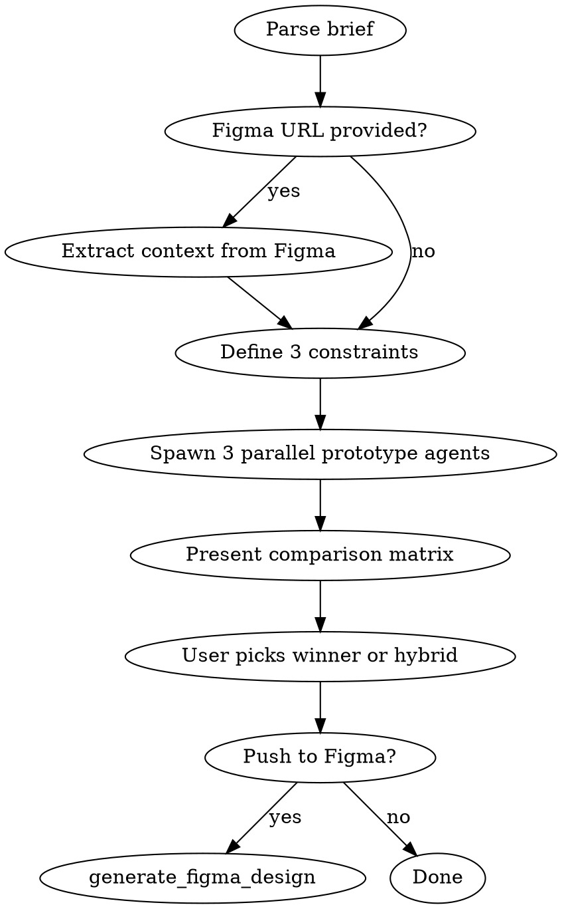

# Parallel Prototype

Generate 3+ structurally different UI prototypes simultaneously, compare them, and push the winner to Figma. Based on Stanford HCI research proving parallel design produces 70% better usability outcomes than serial iteration.

**Core principle:** Your first design idea anchors you. Force 3 genuinely different approaches before committing.

## When to Use

- New feature with unclear UX direction
- Redesign of an existing flow
- Customer-facing screen where getting it wrong is costly
- "I'm not sure of the right approach" situations
- When you want to present options to a designer or stakeholder

## When NOT to Use

- Established patterns with clear precedent (login form, settings page)
- Bug fixes or pixel-level polish
- When design direction is already agreed

## Workflow



### Step 1: Parse the Brief

Extract from `$ARGUMENTS` or conversation:
- **What:** The screen/flow being designed
- **Who:** Target user persona
- **Constraints:** Must-haves, technical limits, brand requirements
- **Figma URL:** Optional — existing design to riff on

### Step 2: Extract Figma Context (if URL provided)

Use Figma MCP to understand the starting point:

```
mcp__figma__get_screenshot   → Visual reference of current state
mcp__figma__get_design_context → Code/structure details
mcp__figma__get_metadata     → Node tree and layout structure
mcp__figma__get_variable_defs → Design tokens in use
```

Summarise: What exists today? What's the user trying to improve?

### Step 3: Define 3 Structural Constraints

**This is the critical step.** Each alternative MUST be structurally different — not cosmetic variations.

Pick 3 constraints from this menu (or invent your own):

| Constraint | Forces |
|---|---|
| **Wizard flow** | Multi-step, progressive disclosure |
| **Single page** | Everything visible, no navigation |
| **Dashboard-first** | Data/status overview, drill into actions |
| **Conversational** | Chat-like, guided, one question at a time |
| **Mobile-first** | Thumb-zone, minimal chrome, vertical scroll |
| **Power-user** | Keyboard shortcuts, dense info, bulk actions |
| **Zero-config** | Smart defaults, minimal inputs, progressive complexity |
| **Card-based** | Visual scanning, comparison, drag-and-drop |

Present the 3 chosen constraints to the user before generating. Example:
```
I'll generate 3 alternatives:
A) Wizard flow — step-by-step guided setup
B) Single page — everything visible with inline editing
C) Dashboard-first — overview with drill-down cards
```

### Step 4: Generate 3 Prototypes in Parallel

Spawn 3 parallel agents using the Task tool. Each agent gets:

**Agent prompt template:**
```
You are building an HTML prototype. Your constraint: [CONSTRAINT].

Read these files first:
- [YOUR_PROTOTYPE_TEMPLATES_PATH]/blank_prototype_template.html
- [YOUR_PROTOTYPE_TEMPLATES_PATH]/DesignSystem.html

Design brief: [BRIEF]
[If Figma context exists: Current design context: [FIGMA_CONTEXT]]

Your constraint is: [CONSTRAINT_NAME] — [CONSTRAINT_DESCRIPTION]

Rules:
- Follow the constraint strictly — it should fundamentally shape your layout and interaction model
- Use design system components from DesignSystem.html
- Vanilla JavaScript only, all JS in single <script> block at end of body
- All interactive elements need focus-ring class
- File name: parallel_[a|b|c]_[brief_slug].html
- Save to: [WORKING_DIRECTORY]

Build the complete, working HTML prototype.
```

Use `subagent_type: "general-purpose"` for each agent. Run all 3 in parallel.

### Step 5: Present Comparison Matrix

After all 3 complete, present a structured comparison:

```markdown
## Comparison: [Brief Title]

| Dimension | A: [Constraint] | B: [Constraint] | C: [Constraint] |
|---|---|---|---|
| **Information density** | Low — guided | High — all visible | Medium — overview + drill |
| **Learning curve** | Easy | Steep | Medium |
| **Power user efficiency** | Low | High | Medium |
| **Mobile friendly** | Yes | No | Partial |
| **Key strength** | [1 sentence] | [1 sentence] | [1 sentence] |
| **Key weakness** | [1 sentence] | [1 sentence] | [1 sentence] |

Files:
- A: `parallel_a_[slug].html`
- B: `parallel_b_[slug].html`
- C: `parallel_c_[slug].html`
```

Open all 3 in browser:
```bash
open parallel_a_*.html parallel_b_*.html parallel_c_*.html
```

Ask user: **Pick a winner, or tell me which elements to combine into a hybrid.**

### Step 6: Push to Figma (Optional)

Ask user: **Push winner only, or all 3 alternatives to Figma for team review?**

**Push all 3 (recommended for team review):**
1. Open Alternative A in Chrome → `generate_figma_design` with `outputMode: "newFile"` → captures page, returns `fileKey`
2. Open Alternative B in Chrome → `generate_figma_design` with `outputMode: "existingFile"` + `fileKey` → adds as new page
3. Open Alternative C in Chrome → `generate_figma_design` with `outputMode: "existingFile"` + `fileKey` → adds as new page
4. Result: One Figma file with 3 pages (A, B, C) — ready for team comments and comparison

**Push winner only:**
1. Open chosen HTML file in Chrome
2. `generate_figma_design` with `outputMode: "newFile"` or `"existingFile"`

**For each push:**
- The tool returns a JavaScript snippet to run in the browser — execute it via chrome-devtools `evaluate_script`
- Poll with `captureId` until complete
- Return the Figma file URL to the user

## Quick Reference

| Phase | Tool | Purpose |
|---|---|---|
| Input (Figma) | `mcp__figma__get_screenshot` | Visual reference |
| Input (Figma) | `mcp__figma__get_design_context` | Code/structure |
| Input (Figma) | `mcp__figma__get_variable_defs` | Design tokens |
| Generate | Task tool (3x parallel) | Build HTML prototypes |
| Output (Figma) | `mcp__figma__generate_figma_design` | Push to Figma |

## Example Invocations

**From scratch:**
```
/parallel-prototype "Onboarding flow for new Lone Worker users — need to set up emergency contacts, enable GPS, and configure check-in schedule"
```

**From Figma:**
```
/parallel-prototype "Redesign the inspection list page" from https://figma.com/design/abc123/Inspections?node-id=456-789
```

**With specific constraints:**
```
/parallel-prototype "Exporter API configuration screen — wizard vs single-page vs dashboard"
```

## Common Mistakes

| Mistake | Fix |
|---|---|
| Generating 3 colour variations | Constraints must be structural — layout, flow, interaction model |
| Skipping the comparison matrix | The comparison IS the value — don't just dump 3 files |
| Picking a winner without opening all 3 | Always open all 3 in browser side by side |
| Over-polishing alternatives | These are throwaway explorations — 80% fidelity is fine |
| Not documenting rejection reasons | Note why B and C were rejected — future-you will want to know |
